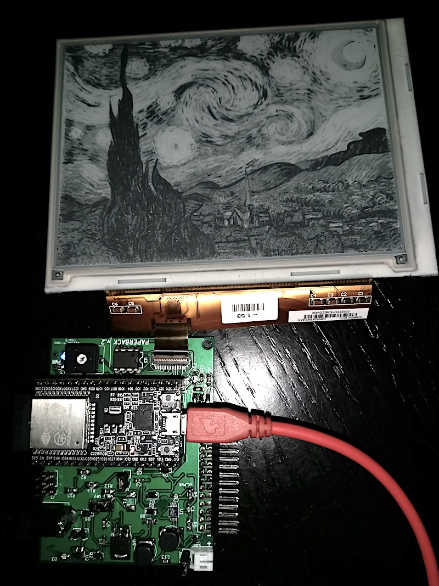

# PaperBack EPaper Display

PaperBack is an internet connected EPaper Breakout and (eventually) Desktop Display.  PaperBack is an entry in the 2017 Hackaday Prize, you can see a more complete (and verbose!) [writeup here](https://hackaday.io/project/21607-paperback-desktop-e-paper-monitor).

Eventually, I plan on having a standard input (VGA? DVI?) onboard to drive an ePaper Display as a second monitor at a maximum of somewhere around 1 frame per second.  The current version is driven by an [ESP32](https://espressif.com/en/products/hardware/esp32/overview) and is updatable over the air.

## Hardware Overview

Currently, PaperBack exists as a single unpublished PCB.  I had to bodge together the first draft due to a mistake in construction.

Expect an update soon for a second PCB spin.

Hardware Overview:

* Espressif ESP32 Dev Board
* ED060SC4 // LB060S01 // LB060S04 6" ePaper Display
    * I plan to test with a ED097OC1 9.7" ePaper Display as Well
* 800x600 Maximum Resolution
    * 1200x825 Maximum if the ED097OC1 works.
* 16 Color (Greyscale) Support / 4-Bit Grey
* Around 1 second for a fullscreen update on 800x600

## Software/Firmware Overview

This first draft has a few firmware versions to choose from for various functionality.  You can find them in `/firmware`.  The most basic firmware (suggested to start) displays a single static image on an ePaper Display.

The Python utility `convert.py` in `/software/image_converter` automatically converts images which are compatible with Paperback.

## Licensing and Other

* My main site: [DQYDJ](https://dqydj.com)
* Where available, all of the code is licensed as MIT.
* Where available, all of the hardware is licensed as MIT.
* If needed, other licenses will be quoted for individual parts.
* I would, of course, _love_ a link if you use any assets - but feel free to use everything as you wish.
